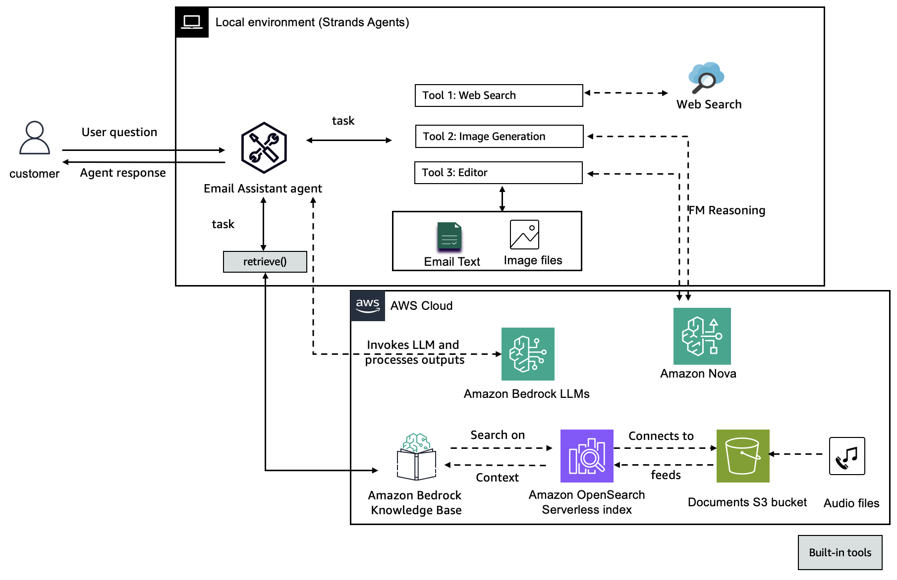

# ✉️ 🔍 Email Assistant with RAG and Image Generation

This project presents a multi-agent Email Assistant that leverages retrieval-augmented generation (RAG), image synthesis, and web data enrichment to generate high-quality, multi-modal email content. Built using the Strands Agents SDK, the assistant coordinates a suite of specialized agents—each responsible for tasks like querying knowledge bases, generating contextual images, and refining email content.

The system architecture integrates Amazon Bedrock for both text and image generation, a Knowledge Base for enterprise data retrieval, and optional web research capabilities to supplement real-time context. The final output is a well-structured, polished email that includes relevant knowledge snippets and visually compelling elements, all orchestrated through a single plain-language request.



## 1. What is this?

A comprehensive email assistant that leverages knowledge base retrieval and image generation capabilities.

| Function | Agent/Tool | Data Source | Output |
|----------|------------|-------------|--------|
| Orchestration | `email_assistant` | Coordinates tools & writes final email | Structured Markdown / HTML |
| Knowledge Retrieval | `retrieve_from_kb` | Amazon Bedrock Knowledge Base | Relevant context from audio/text |
| Image Creation | `generate_image_nova` | Amazon Bedrock Nova Canvas | Custom images for email content |
| Web Research | `http_request` | Public web | Supplementary information |
| Content Editing | `editor` | Amazon Nova | Polished email content |

## 2. Flow overview 🚦

1. **User** ➜ `email_assistant` with a plain-language email request
2. Assistant analyzes request and determines needed resources:
   - Knowledge context? → calls `retrieve_from_kb` to query Knowledge Base
   - Visual content? → calls `generate_image_nova` to create relevant images
   - Additional facts? → uses `http_request` for web research
3. Assistant synthesizes all gathered information
4. Final polished email returned to the user with embedded images and context

## 3. Email format 📋

The assistant creates professional emails with:

- Proper structure (greeting, body, closing)
- Relevant knowledge base context integrated naturally
- Custom-generated images when appropriate
- Web research findings incorporated seamlessly
- Professional tone and formatting

## 4. Quick start 🛠️

### Prerequisites

- Python 3.10+
- AWS CLI v2 configured
- [Access](https://docs.aws.amazon.com/bedrock/latest/userguide/model-access-modify.html) to Amazon Bedrock (Nova in us-east-1 region and Knowledge Base in your preferred region)

### Step 1: Set up Knowledge Base

1. Run the notebooks in [Multi-modal-data-ingest/audio-video-rag/](./Multi-modal-data-ingest/audio-video-rag/) folder to process audio files
2. Create a Bedrock Knowledge Base and note the KB ID

### Step 2: Run the Email Assistant

```bash
python email_assistant.py --kb-id YOUR_KB_ID --region replace_your_region
```

### Optional: Run individual agents

#### Run the KB RAG agent

```bash
python kb_rag.py --kb-id YOUR_KB_ID
```

#### Run the image generation agent

```bash
python image_generation_agent.py
```

## 5. AWS Architecture 🏗️

| Component Type | AWS Service | Purpose |
|----------------|-------------|---------|
| Data Pipeline | Bedrock Data Automation | Processes audio files into embeddings |
| Storage Layer | S3 | Stores documents, images, and processed data |
| Search Layer | Amazon Bedrock Knowledge Base | Vector/keyword index for knowledge retrieval |
| AI Services | Amazon Nova | Foundation model for text generation and image creation |
| Compute | Amazon SageMaker | Notebook environment for development |

## 6. Troubleshooting 🐞

| Symptom | Likely Cause | Fix |
|---------|-------------|-----|
| NoCredentialsError | AWS credentials not exported | Run `aws configure --profile <profile>` |
| Knowledge Base Error | KB ID incorrect or in wrong region | Verify KB ID and region match where KB was created |
| Image Generation Fails | Token limit exceeded | Reset conversation after each interaction |
| ImportError Strands SDK | Missing Strands SDK | Check Python path includes SDK locations |
| ModuleNotFoundError | Incorrect import structure | Use absolute imports when running as script |

## 7. Usage Examples

### Basic Email Request

```bash
Email Request> Write an email to my team about our Q3 financial results
```

### Email with Knowledge Base Context

```bash
Email Request> Write an email summarizing the key points from our last earnings call
```

### Email with Custom Image

```bash
Email Request> Write an email announcing our new product launch with an image of a futuristic device
```

## 8. Advanced Configuration

You can customize the Email Assistant by modifying:

- The system prompt in `create_email_assistant()` function
- The default region and KB ID in the script
- The tools available to the assistant

For production use, consider:

- Setting up persistent storage for generated images
- Implementing authentication for sensitive knowledge bases
- Creating a web interface using Streamlit or Flask

## 9. Cleanup

After you're done using the Email Assistant, you should clean up the resources to avoid incurring unnecessary costs.

### Option 1: Clean up in the notebook

If you created the knowledge base using the notebook in `Multi-modal-data-ingest/audio-video-rag/`, you can run the cleanup cell at the end of the notebook:

```python
# Delete Knowledge Base
knowledge_base.delete_kb(delete_s3_bucket=True, delete_iam_roles_and_policies=True)
```